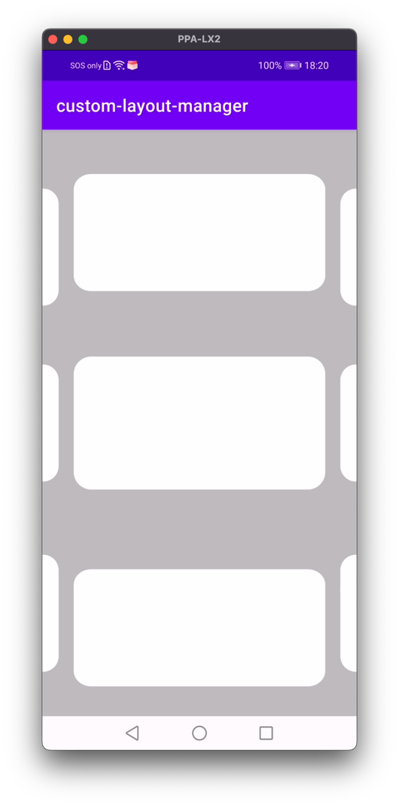

# custom-layout-manager

Library for custom layout manager on Android.

[](https://jitpack.io/#prongbang/custom-layout-manager)

## Preview



## Setup

- `build.gradle`

```groovy
buildscript {
    repositories {
        maven { url 'https://jitpack.io' }
    }
}
```

- `settings.gradle`

```groovy
dependencyResolutionManagement {
    repositories {
        maven { url 'https://jitpack.io' }
    }
}
```

- `app/build.gradle`

```groovy
implementation 'com.github.prongbang:custom-layout-manager:1.0.1'
```

## How to use

```kotlin
private fun initLoad() {
    val cards = arrayListOf<Card>()
    for (i in 1..100) {
        cards.add(Card(i))
    }
    mainAdapter.submitList(cards)

    // Trigger scroll
    recyclerViewUp.triggerScroll()
    recyclerViewZoom.triggerScroll()
    recyclerViewDown.triggerScroll()
}

private fun initView() {
    binding.apply {
        recyclerViewUp.apply {
            adapter = mainAdapter
            layoutManager = CenterUpLayoutManager(context, RecyclerView.HORIZONTAL, false, pixelSpace = 50f)
            pagerSnapper()
        }

        recyclerViewZoom.apply {
            adapter = mainAdapter
            layoutManager = CenterZoomLayoutManager(context, RecyclerView.HORIZONTAL, false)
            pagerSnapper()
        }

        recyclerViewDown.apply {
            adapter = mainAdapter
            layoutManager = CenterDownLayoutManager(context, RecyclerView.HORIZONTAL, false, pixelSpace = 50f)
            pagerSnapper()
        }
    }
}
```